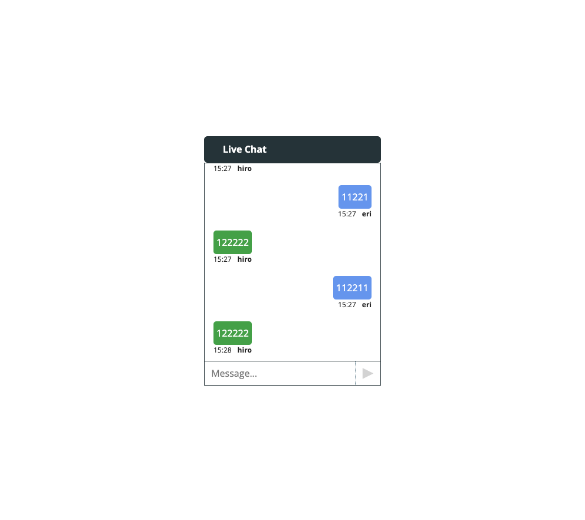

# Socket.io-chatApp-with-React

This is Socket.io project with React.
The project is from Youtube channel (https://www.youtube.com/watch?v=NU-HfZY3ATQ)

And, in my opinion, the video is very useful for me. (If you are going to want to create socket.io project with React, I hightly recommed.)
The course's project is not attractive (because css styling is cheap) but the programmer in this channel has good explanation skills.
And, I can get fundamental knowledge of socket.io.

This is very simple project. 
So, I do not deploy demo site.

Thank you for reading.
And, happy coding!!
